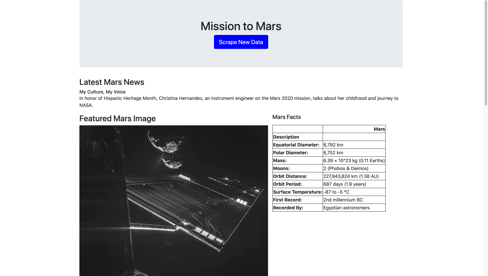
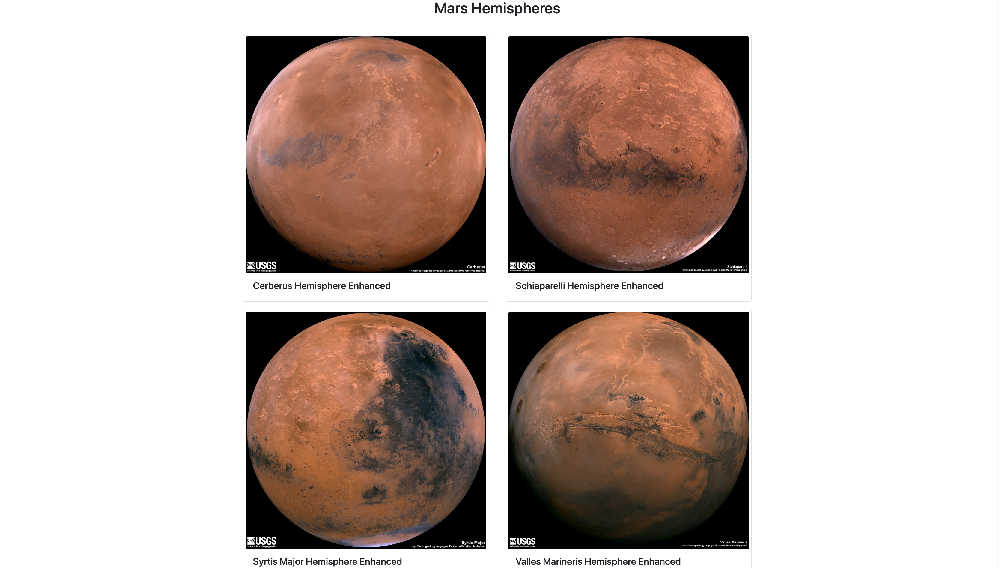

# Mission to Mars

Project Goal: Build a web application that scrapes various websites for data related to the Mission to Mars and displays the information in a single HTML page.
## Step 1 - Scraping
* Develop initial scraping scripts using Jupyter Notebook, BeautifulSoup, Pandas, and Requests/Splinter.
### NASA Mars News
* Scrape the [NASA Mars News Site](https://mars.nasa.gov/news/) and collect the latest News Title and Paragraph Text.
### JPL Mars Space Images - Featured Image
* Visit the url for JPL Featured Space Image [here](https://www.jpl.nasa.gov/spaceimages/?search=&category=Mars).
* Use splinter to navigate the site and find the image url for the current Featured Mars Image and assign the url string to a variable called `featured_image_ur
### Mars Facts
* Visit the Mars Facts webpage [here](https://space-facts.com/mars/) and use Pandas to scrape the table containing facts about the planet including Diameter, Mass, etc.
* Use Pandas to convert the data to a HTML table string.
### Mars Hemispheres
* Visit the USGS Astrogeology site [here](https://astrogeology.usgs.gov/search/results?q=hemisphere+enhanced&k1=target&v1=Mars) to obtain high resolution images for each of Mar’s hemispheres.
## Step 2 - MongoDB and Flask Application
Use MongoDB with Flask templating to create a new HTML page that displays all of the information that was scraped from the URLs above.

### Copyright
Trilogy Education Services © 2020. All Rights Reserved.
NASA’s Mars Exploration ProgramNASA’s Mars Exploration Program
News  – NASA’s Mars Exploration Program
NASA’s real-time portal for Mars exploration, featuring the latest news, images, and discoveries from the Red Planet. (132 kB)
https://mars.nasa.gov/news/

Space FactsSpace Facts
Mars Facts - Interesting Facts about Planet Mars
Mars is the fourth planet from the Sun and is the second smallest planet in the solar system. Named after the Roman god of war,
Est. reading time
5 minutes
astrogeology.usgs.govastrogeology.usgs.gov
Astropedia Search Results | USGS Astrogeology Science Center
USGS Astrogeology Science Center Astropedia search results.
